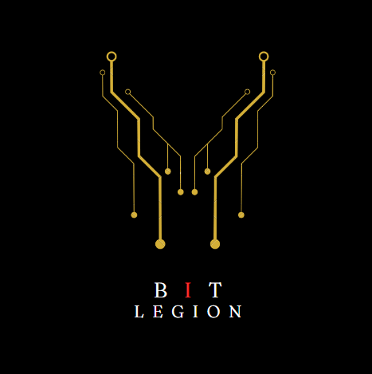
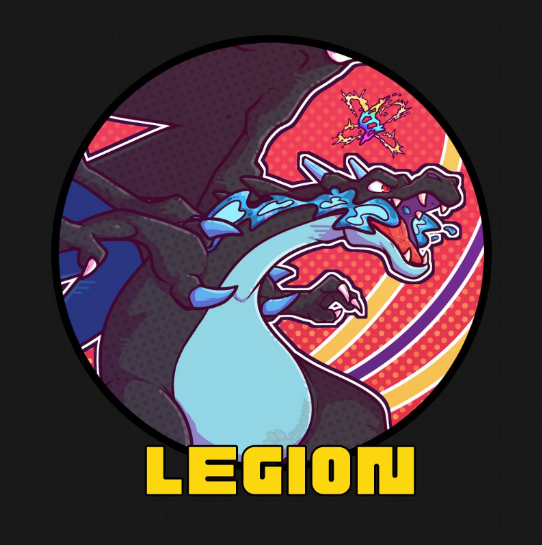
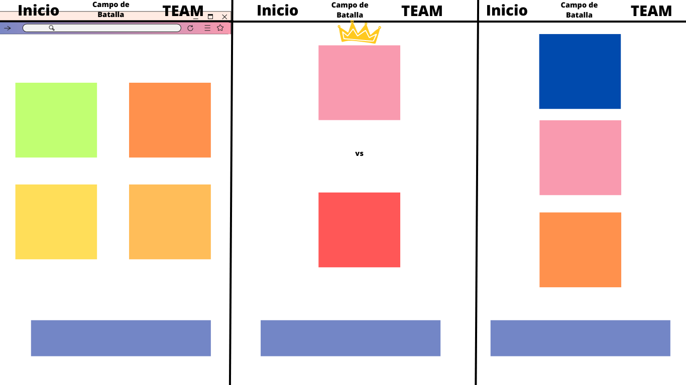
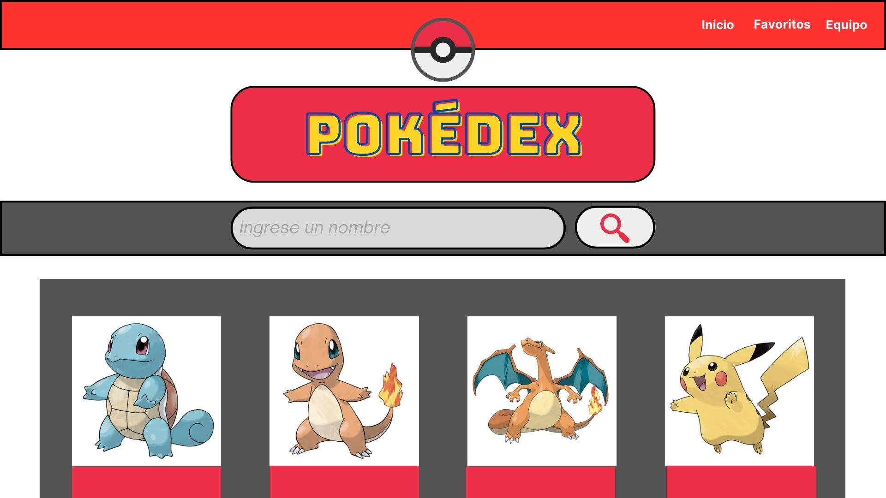
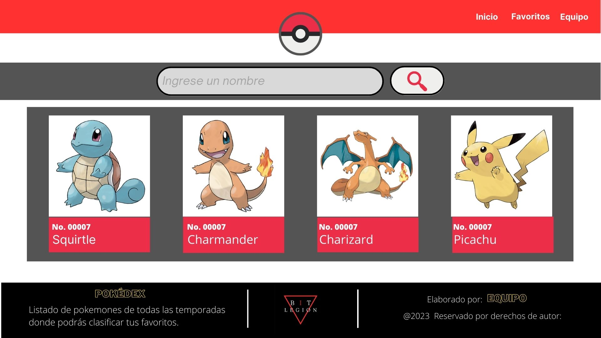
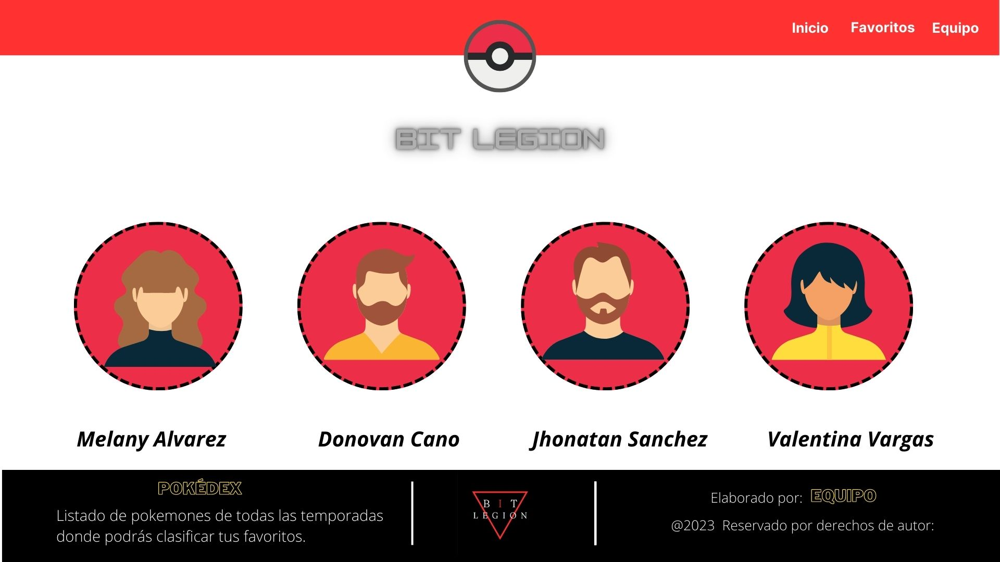

# BIT LEGION
## Descripción
En este sitio Web consumiremos una API donde encontraremos un listado de los Pokemones mas comunes y podremos clasificarlos segun tus favoritos, modificando sus nombres segun tu preferencia.

## Herramientas de Desarrollo
* ReactJS
* Bootstrap de React

## Comandos para correr proyecto
- npm install
- npm run dev

## Responsables
### Responsable repositorio:
Donovan Cano 
### Responsable Documentación 
Valentina Vargas
### Responsable Wireframe de alta
Jhonatan Sanchez

## Documentación:
Trello

## Guia de Estilos
Fuentes:
Fraunces Thin- bungee- open sans light

Colores:
Principales: Gris, Blanco, Negro, rojo.
## Logo 1

## Logo 2

## Wireframe de Baja

## Wireframe de Alta

## Autores:
* Donovan Cano
* Melany Alvarez
* Jhonathan Sanchez
* Valentina Vargas
